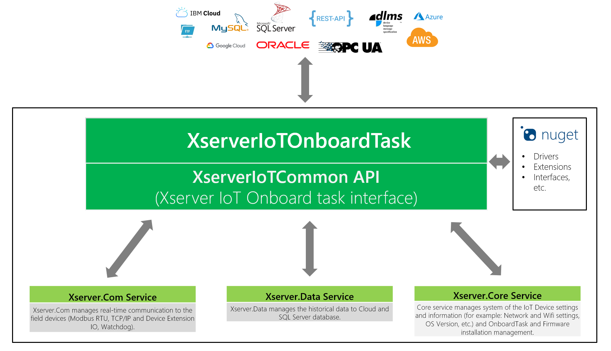
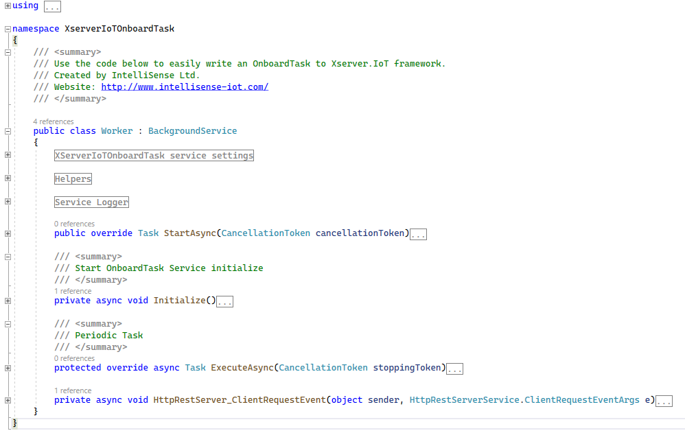

# OnboardTask Architecture Overview

## Interfaces:

## Code:

## More details:

### XServerIoTOnboardTask service settings
        
    //Service display name
    private const string ServiceDisplayName = "Xserver.OnboardTask";
    
    //Task Handler Period (ms)
    private const int TaskHandlerPeriod = 1000;
 
### First Run
 
In the code below, the tasks required for the first run are performed.
    
     private async void Initialize()
        {
            await EventLogging.AddLogMessage(MessageType.Info, this.GetType().Name + " - " + ServiceDisplayName + " - " + "Start initializing...");

            try
            {
                //Initialize Http REST server
                await RestServer.HttpRESTServerStart();
                RestServer.ClientEvent += HttpRestServer_ClientRequestEvent;

                //Todo: Write your initial code here
                //_logger.LogInformation("Debug message");
            }
            catch (Exception ex)
            {
                await EventLogging.AddLogMessage(MessageType.ExceptionError, this.GetType().Name + " - " + ServiceDisplayName + " - " + "Initialization exception error! Error: " + ex.Message);
            }

            await EventLogging.AddLogMessage(MessageType.Info, this.GetType().Name + " - " + ServiceDisplayName + " - " + "Finished initialization.");
        }

### RESTAPI Calls

We can make our own RESTAPI interface that external applications can call. GET and POST calls are supported.
This RESTAPI interface is used by the DATA service also, which invokes certain events ([for example: Desired properties change callback](https://github.com/IntelliSenseIoT/XserverIoTOnboardTask.github.io/blob/master/examples/6_Device_Twin_Desired_Change_Callback.md)). 
    
     private async void HttpRestServer_ClientRequestEvent(object sender, HttpRestServerService.ClientRequestEventArgs e)
        {
            IO.NET.SimpleHttpServer.Result res = new IO.NET.SimpleHttpServer.Result();

            try
            {
                if (e.RequestMethod == RequestMethodType.GET)
                {
                    //Todo: Type your code here
                    //_logger.LogInformation("Debug message");
                    // Example:
                    //if (e.uriString.ToLower() == "/onboardtask/examplegeturi")
                    //{
                    //    string content = JsonConvert.SerializeObject(YourObject);
                    //    res = await RestServer.ServerResponse(HTTPStatusCodes.OK, e.OStream, content);
                    //}
                }
                else if (e.RequestMethod == RequestMethodType.POST)
                {
                    //Todo: Type your code here
                    //_logger.LogInformation("Debug message");
                    // Example:
                    //if (e.uriString.ToLower() == "/onboardtask/exampleposturi")
                    //{  
                    //    YourObject MyObj = JsonConvert.DeserializeObject<YourObject>(e.HttpContent);
                    //    ....
                    //    string content = JsonConvert.SerializeObject(answer);
                    //    res = await RestServer.ServerResponse(HTTPStatusCodes.OK, e.OStream, content);
                    //}
                }
                else
                {
                    res = await RestServer.ServerResponse(HTTPStatusCodes.Not_Found, e.OStream, null);
                }
            }
            catch (Exception ex)
            {
                await EventLogging.AddLogMessage(MessageType.ExceptionError, this.GetType().Name + " - " + ServiceDisplayName + " - " + "Http REST server exception error! Error: " + ex.Message);
            }
        }
