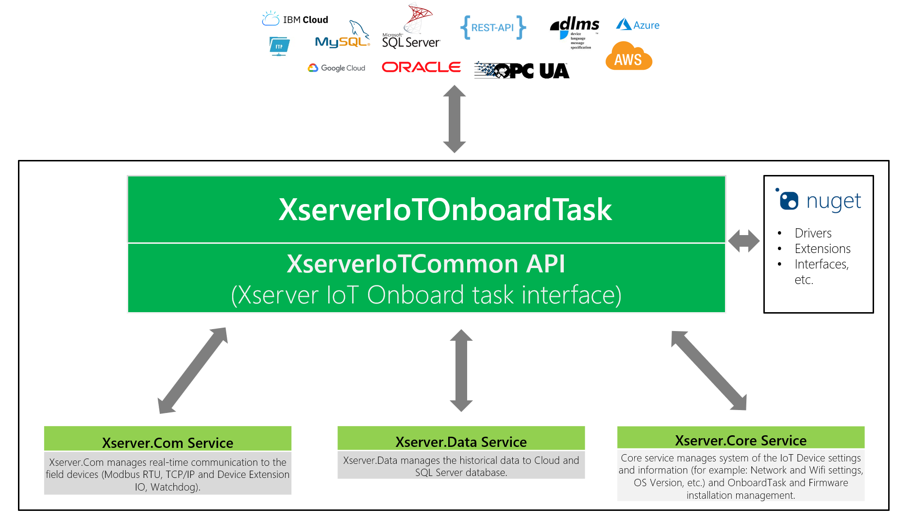
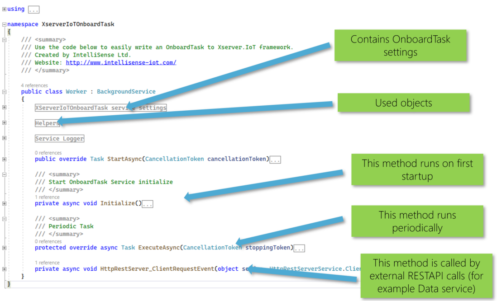

# OnboardTask Architecture Overview

## Interfaces:

## Code:

## More details:

### XServerIoTOnboardTask service settings
        
    //Service display name
    private const string ServiceDisplayName = "Xserver.OnboardTask";
    
    //Task Handler Period (ms)
    private const int TaskHandlerPeriod = 1000;
 
### First Run
 
In the code below, the tasks required for the first run are performed.
    
         /// 

         /// Start OnboardTask Service initialize
         /// 

         private async Task Initialize(CancellationToken ct)
         {
             #region For Test mode
             string? serviceipTestMode = null;
             if (InitializeHelpers.generalSettings.IsTestMode)
             {
                 if (InitializeHelpers.generalSettings.LocalConnect) //Local test
                 {
                     XserverIoTConnectivityInterface.LocalConnect = true;
                     XserverIoTConnectivityInterface.LastIP = InitializeHelpers.generalSettings.IP;
                     serviceipTestMode = XserverIoTConnectivityInterface.LastIP;
                 }
                 else //Remote Azure test
                 {
                     XserverIoTConnectivityInterface.LocalConnect = false;
                     XserverIoTConnectivityInterface.ConnectedIoTDeviceID = InitializeHelpers.generalSettings.ConnectedIoTDeviceID;
                     XserverIoTConnectivityInterface.IoTHubConnectionString = InitializeHelpers.generalSettings.IoTHubConnectionString;
                     XserverIoTConnectivityInterface.IoTDeviceService_CloudConnectionInitialize();
                 }
             }
             #endregion
        
             using var scope = _logger.BeginScope("Init {Service}", ServiceDisplayName);
        
             _logger.LogInformation("{Service} - Start initializing...", ServiceDisplayName);
             await EventLogging.AddLogMessage(MessageType.Info, $"{GetType().Name} - {ServiceDisplayName} - Start initializing...");
        
             try
             {
                 #region Initialize Http REST server
                 var srvresult = await RestServer.HttpRESTServerStart();
                 if (!srvresult.Success)
                 {
                     _logger.LogError("{Service} - HttpRESTServer error: {error}", ServiceDisplayName, srvresult.ErrorMessage);
                 }
                 else
                 {
                     RestServer.ClientEvent += HttpRestServer_ClientRequestEvent;
                     _logger.LogInformation("{Service} - HttpRESTServer finished initialization.", ServiceDisplayName);
                 }
                 #endregion
        
                 #region Wait for platform services (Com/Data/Core)
                 await InitializeHelpers.WaitForServicesAsync(_logger, GetType().Name, ServiceDisplayName, ct);
                 if (ct.IsCancellationRequested) return;
        
                 // Login
                 bool loginOk = await InitializeHelpers.LoginToXserverAsync(_logger, GetType().Name, ServiceDisplayName, serviceipTestMode, ct);
                 if (!loginOk || ct.IsCancellationRequested)
                 {
                     _logger.LogWarning("{Service} - Login aborted (cancelled or failed).", ServiceDisplayName);
                     return;
                 }
                 #endregion
        
                 #region OnboardTask Config and Properties
                 // --- CONFIG ---
                 var onboardconfig = await XserverIoTCommon.OnboardTask.GetConfig();
                 if(onboardconfig.Success)
                 {
                     if (!string.IsNullOrWhiteSpace(onboardconfig.Content))
                     {
                         try
                         {
                             onboardtaskConfig = JsonConvert.DeserializeObject<OnboardTaskConfig>(onboardconfig.Content) ?? throw new JsonSerializationException("OnboardTask Config deserialization returned null.");
        
                             bool savereq = false;
                             savereq = InitializeHelpers.HasMissingOnboardTaskConfigs(onboardconfig.Content);
        
                             if (savereq)
                             {
                                 string updatedJson = InitializeHelpers.MergeConfigIntoRootJson(onboardconfig.Content, onboardtaskConfig, true);
                                 if (updatedJson != null)
                                 {
                                     await XserverIoTCommon.OnboardTask.SaveConfig(updatedJson);
                                 }
                                 else
                                 {
                                     throw new JsonSerializationException("OnboardTask Config merge failed.");
                                 }
                             }
        
                             if (onboardtaskConfig.MyApp_Settings_Debug == true)
                             {
                                 _logger.LogInformation("{Service} - Debug mode enabled (verbose/diagnostic logging active).", ServiceDisplayName);
        
                             }
                         }
                         catch (Exception ex)
                         {
                             await EventLogging.AddLogMessage(MessageType.ExceptionError, $"{GetType().Name} - {ServiceDisplayName} - OnboardTask Config parse error! {ex.Message}");
                             _logger.LogCritical($"{GetType().Name} - {ServiceDisplayName} - OnboardTask Config parse error! {ex.Message}");
                         }
                     }
                     else
                     {
                         // Empty → save defaults
                         string content = JsonConvert.SerializeObject(onboardtaskConfig, Formatting.Indented);
                         await XserverIoTCommon.OnboardTask.SaveConfig(content);
                     }
                 }
                 else
                 {
                     await EventLogging.AddLogMessage(MessageType.Error, $"{GetType().Name} - {ServiceDisplayName} - OnboardTask Config error! {onboardconfig.ErrorMessage}");
                     _logger.LogError($"{GetType().Name} - {ServiceDisplayName} - OnboardTask Config error! {onboardconfig.ErrorMessage}");
                 }
        
                 // --- PROPERTIES ---
                 var onboardproperties = await XserverIoTCommon.OnboardTask.GetProperties();
                 if (onboardproperties.Success)
                 {
                     if (!string.IsNullOrWhiteSpace(onboardproperties.Content))
                     {
                         try
                         {
                             onboardtaskProperties = JsonConvert.DeserializeObject<OnboardTaskProperties>(onboardproperties.Content) ?? throw new JsonSerializationException("OnboardTask Properties deserialization returned null."); ;
                             bool savereq = false;
                             savereq = InitializeHelpers.HasMissingOnboardTaskProps(onboardproperties.Content);
        
                             if (savereq)
                             {
                                 string? updatedJson = InitializeHelpers.MergePropertiesIntoRootJson(onboardproperties.Content, onboardtaskProperties, true);
        
                                 if (updatedJson != null)
                                 {
                                     await XserverIoTCommon.OnboardTask.SaveProperties(updatedJson);
                                 }
                                 else
                                 {
                                     throw new JsonSerializationException("OnboardTask Properties merge failed.");
                                 }
                             }
                         }
                         catch (Exception ex)
                         {
                             await EventLogging.AddLogMessage(MessageType.ExceptionError, $"{GetType().Name} - {ServiceDisplayName} - OnboardTask Properties parse error! {ex.Message}");
                             _logger.LogCritical($"{GetType().Name} - {ServiceDisplayName} - OnboardTask Properties parse error! {ex.Message}");
                         }
                     }
                     else
                     {
                         string content = JsonConvert.SerializeObject(onboardtaskProperties, Formatting.Indented);
                         await XserverIoTCommon.OnboardTask.SaveProperties(content);
                     }
                 }
                 else
                 {
                     await EventLogging.AddLogMessage(MessageType.Error, $"{GetType().Name} - {ServiceDisplayName} - OnboardTask Properties error! {onboardproperties.ErrorMessage}");
                     _logger.LogError($"{GetType().Name} - {ServiceDisplayName} - OnboardTask Properties error! {onboardproperties.ErrorMessage}");
                 }
                 #endregion
        
                 if (ct.IsCancellationRequested) return;
        
                 #region Gets List of Sources and Quantities
                 bool realtimeOk = await InitializeHelpers.WaitForRealtimeDataAsync(_logger, this.GetType().Name, ServiceDisplayName, RealTimeValuesObj, ct);
        
                 if (!realtimeOk)
                 {
                     _logger.LogWarning("{Service} - Initialization aborted, realtime fetch cancelled.", ServiceDisplayName);
                     return;
                 }
                 #endregion
        
                 InitFinished = true;
        
                 await EventLogging.AddLogMessage(MessageType.Info, $"{GetType().Name} - {ServiceDisplayName} - Finished initialization.");
                 _logger.LogInformation("{Service} - Finished initialization.", ServiceDisplayName);
             }
             catch (OperationCanceledException)
             {
                 _logger.LogWarning("{Service} - Initialization cancelled.", ServiceDisplayName);
             }
             catch (Exception ex)
             {
                 await EventLogging.AddLogMessage(MessageType.ExceptionError, $"{GetType().Name} - {ServiceDisplayName} - Initialization exception! Error: {ex.Message}");
                 _logger.LogError(ex, "{Service} - Initialization exception.", ServiceDisplayName);
             }
         }
        
### RESTAPI Calls
        
        We can make our own RESTAPI interface that external applications can call. GET and POST calls are supported.
        This RESTAPI interface is used by the DATA service also, which invokes certain events ([for example: Desired properties change callback](https://github.com/IntelliSenseIoT/XserverIoTOnboardTask.github.io/blob/master/examples/6_Device_Twin_Desired_Change_Callback.md)). 
            
             private async void HttpRestServer_ClientRequestEvent(object sender, HttpRestServerService.ClientRequestEventArgs e)
             {
                    IO.NET.SimpleHttpServer.Result res = new IO.NET.SimpleHttpServer.Result();
        
                    try
                    {
                        if (e.RequestMethod == RequestMethodType.GET)
                        {
                            //Todo: Type your code here
                            //_logger.LogInformation("Debug message");
                            // Example:
                            //if (e.uriString.ToLower() == "/onboardtask/examplegeturi")
                            //{
                            //    string content = JsonConvert.SerializeObject(YourObject);
                            //    res = await RestServer.ServerResponse(HTTPStatusCodes.OK, e.OStream, content);
                            //}
                        }
                        else if (e.RequestMethod == RequestMethodType.POST)
                        {
                            //Todo: Type your code here
                            //_logger.LogInformation("Debug message");
                            // Example:
                            //if (e.uriString.ToLower() == "/onboardtask/exampleposturi")
                            //{  
                            //    YourObject MyObj = JsonConvert.DeserializeObject<YourObject>(e.HttpContent);
                            //    ....
                            //    string content = JsonConvert.SerializeObject(answer);
                            //    res = await RestServer.ServerResponse(HTTPStatusCodes.OK, e.OStream, content);
                            //}
                        }
                        else
                        {
                            res = await RestServer.ServerResponse(HTTPStatusCodes.Not_Found, e.OStream, null);
                        }
                    }
                    catch (Exception ex)
                    {
                        await EventLogging.AddLogMessage(MessageType.ExceptionError, this.GetType().Name + " - " + ServiceDisplayName + " - " + "Http REST server exception error! Error: " + ex.Message);
                    }
            }
