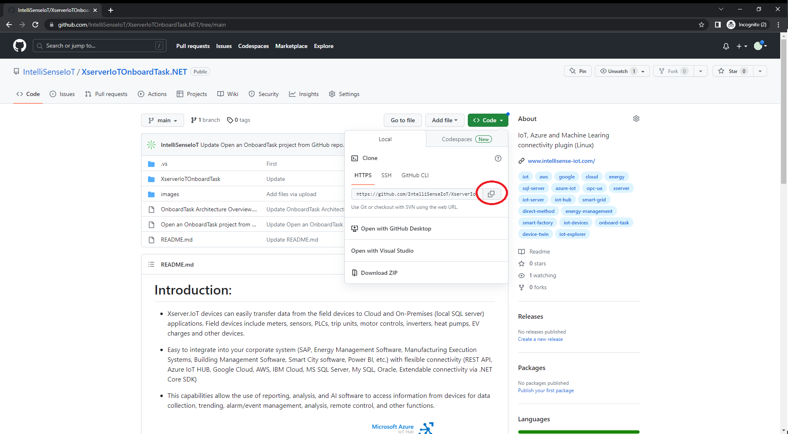
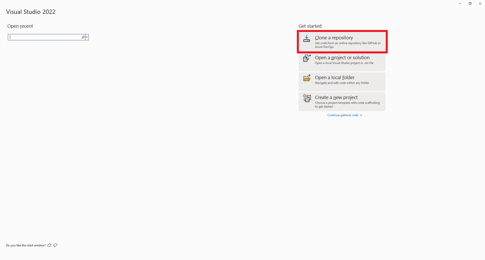
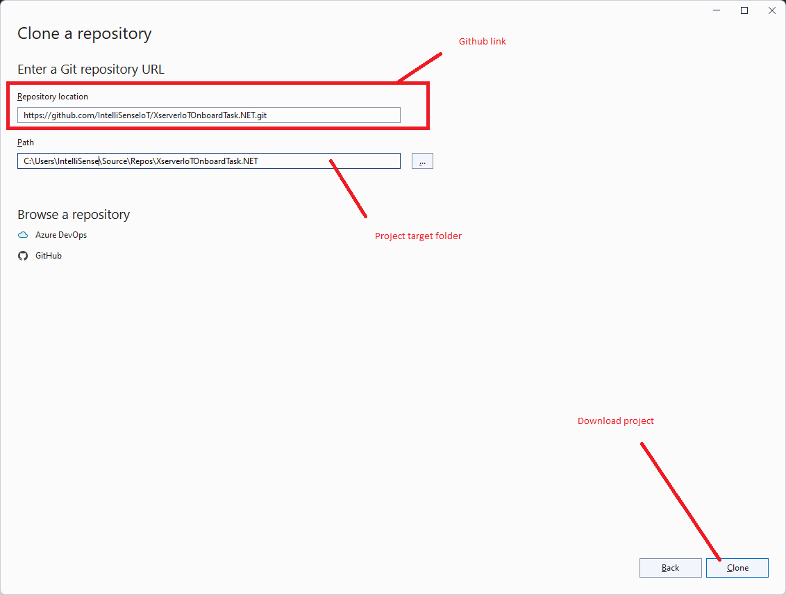
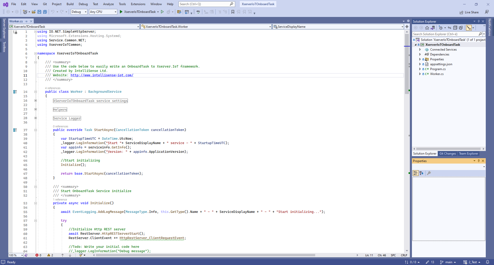

# Open an OnboardTask project from GitHub repo

## Prerequisites

- Visual Studio 2022 - [Download & Install](https://visualstudio.microsoft.com/downloads/)

## Steps

1) Open IoT Server OnboardTask project on Github website [Click here](https://github.com/IntelliSenseIoT/XserverIoTOnboardTask.NET)
2) Copy the repository location

3) Open Visual Studio 2022

4) Paste the repository location and then select Clone.

[Microsoft Tutorial: Open a project from a repo](https://learn.microsoft.com/en-us/visualstudio/get-started/tutorial-open-project-from-repo?view=vs-2022&tabs=vs168later)
