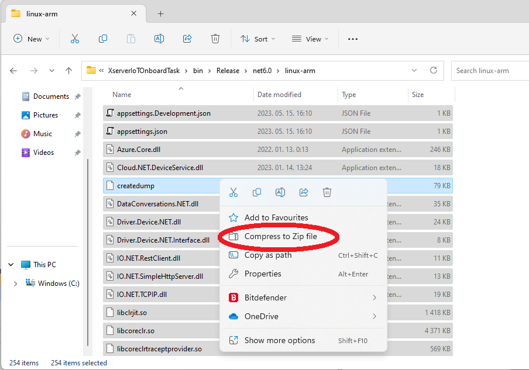
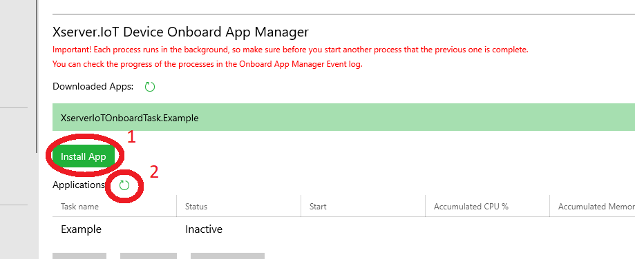
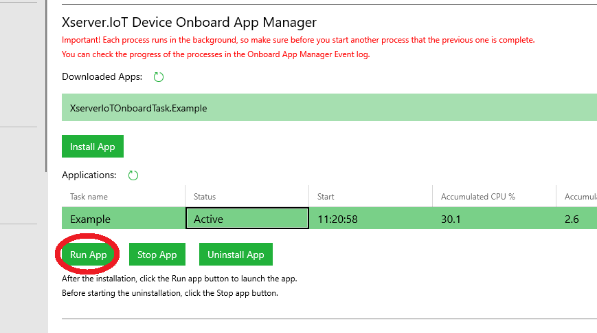

# Publish your OnboardTask project
Publish your project:

Compress your project files to a zip file. The file name must be XserverIoTOnboardTask.YOURTASKNAME.zip:

Upload your App file (XserverIoTOnboardTask.YOURTASKNAME.zip) from your computer to Azure Storage:

Download your App file from Azure Storage to your IoT Device:

Install and run your app:

