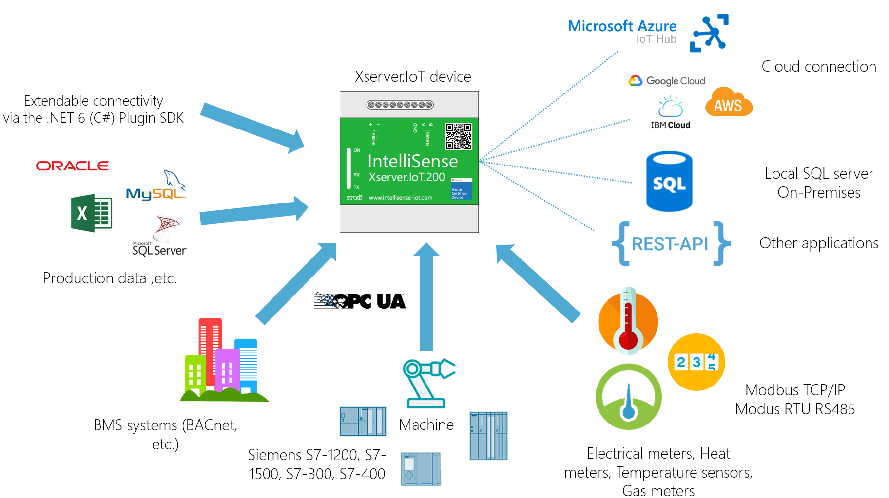
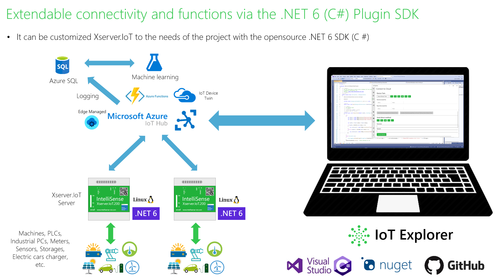

# Introduction:

- Xserver.IoT devices can easily transfer data from the field devices to Cloud and On-Premises (local SQL server) applications. Field devices include meters, sensors, PLCs, trip units, motor controls, inverters, heat pumps, EV charges and other devices.

- Easy to integrate into your corporate system (SAP, Energy Management Software, Manufacturing Execution Systems, Building Management Software, Smart City software, Power BI, etc.) with flexible connectivity (REST API, Azure IoT HUB, Google Cloud, AWS, IBM Cloud, MS SQL Server, My SQL, Oracle, Extendable connectivity via .NET Core SDK)

- This capabilities allow the use of reporting, analysis, and AI software to access information from devices for data collection, trending, alarm/event management, analysis, remote control, and other functions.

# Xserver.IoT OnboardTask Overview:

With the Onboard Task project can be implemented customized tasks (Industrial PC communication, Custom protocol matching, Control tasks, Remote parameter setting from cloud, Control with Artificial Intelligence, etc.).

- More details: https://www.intellisense-iot.com/
- [Technical overview about IoT Server](https://www.intellisense-iot.com/xserver-iot-product) 
- [Open an OnboardTask project from GitHub repo](https://github.com/IntelliSenseIoT/XserverIoTOnboardTask.NET/blob/main/Open%20an%20OnboardTask%20project%20from%20GitHub%20repo.md)
- [OnboardTask Architecture Overview](https://github.com/IntelliSenseIoT/XserverIoTOnboardTask.NET/blob/main/OnboardTask%20Architecture%20Overview.md)
- [Publish your OnboardTask project (create zip package file)](https://github.com/IntelliSenseIoT/XserverIoTOnboardTask.NET/blob/main/Publish%20your%20OnboardTask%20project.md)
- [XserverIoTCommon API description](https://github.com/IntelliSenseIoT/XserverIoTOnboardTask.NET/blob/main/XserverIoTCommon.NET.md)
- [Xserver.IoT REST API interface documentation](https://github.com/IntelliSenseIoT/XserverIoTOnboardTask.NET/blob/main/XserverIoT_RestAPI_Interface_doumentation.md)

# XserverIoTOnboardTask:

## Required Xserver.IoT firmware

    Required Xservet.IoT.200 device
    Min version: 11.0.x

# Examples:

[Example 1 - Real-time values (Access Sources and Quantites)](https://github.com/IntelliSenseIoT/XserverIoTOnboardTask.NET/blob/main/examples/1_Real-time%20values.md)
