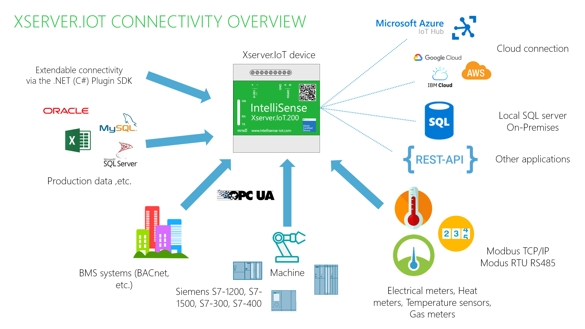
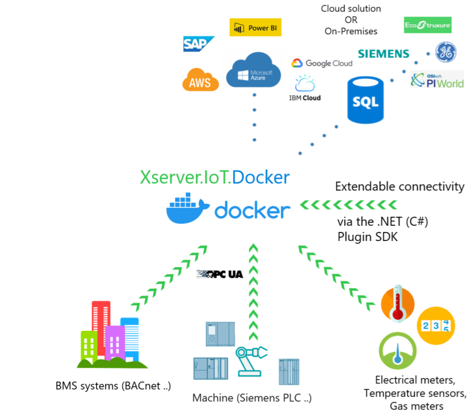

# Introduction:

- Xserver.IoT devices can easily transfer data from the field devices to Cloud and On-Premises (local SQL server) applications. Field devices include meters, sensors, PLCs, trip units, motor controls, inverters, heat pumps, EV charges and other devices.

- Easy to integrate into your corporate system (SAP, Energy Management Software, Manufacturing Execution Systems, Building Management Software, Smart City software, Power BI, etc.) with flexible connectivity (REST API, Azure IoT HUB, Google Cloud, AWS, IBM Cloud, MS SQL Server, My SQL, Oracle, Extendable connectivity via .NET SDK)

- This capabilities allow the use of reporting, analysis, and AI software to access information from devices for data collection, trending, alarm/event management, analysis, remote control, and other functions.

# Xserver.IoT.Docker Installation

Xserver.IoT.Docker is a containerized industrial IoT runtime platform built for secure, scalable edge deployments.

## Installation & Licensing

The official `install.sh` deployment script and required license files
are distributed upon request.

To obtain the installer, please contact: **helpdesk@intellisense-iot.com**\
or submit a request via the Contact form on our website.

Following registration and license validation, we will provide:

-   The official deployment installer (`install.sh`)
-   The appropriate license file (Free Tier or Enterprise Runtime)

## Useful links:

- [System Requirements & Network Prerequisites](https://github.com/IntelliSenseIoT/XserverIoTOnboardTask.NET/blob/main/Docker/Xserver_IoT_Docker_System_Requirements.md) 
- [WSL and SSH Installation on Windows 11](https://github.com/IntelliSenseIoT/XserverIoTOnboardTask.NET/blob/main/Docker/InstallWSL.md) 
- [Xserver.IoT.Docker – Installation Guide](https://github.com/IntelliSenseIoT/XserverIoTOnboardTask.NET/blob/main/Docker/installdocker.md)
- [Xserver.IoT.Docker – License Registration](https://github.com/IntelliSenseIoT/XserverIoTOnboardTask.NET/blob/main/Docker/LicenseRegistration.md)
  
# Xserver.IoT.200 and Xserver.IoT.Docker OnboardTask Overview:

With the Onboard Task project can be implemented customized tasks (Industrial PC communication, Custom protocol matching, Control tasks, Remote parameter setting from cloud, Control with Artificial Intelligence, etc.).

- More details: https://www.intellisense-iot.com/
- [Technical overview about IoT Server](https://www.intellisense-iot.com/xserver-iot-product) 
- [Open an OnboardTask project from GitHub repo](https://github.com/IntelliSenseIoT/XserverIoTOnboardTask.NET/blob/main/Open%20an%20OnboardTask%20project%20from%20GitHub%20repo.md)
- [OnboardTask Architecture Overview](https://github.com/IntelliSenseIoT/XserverIoTOnboardTask.NET/blob/main/OnboardTask%20Architecture%20Overview.md)
- [Publish your OnboardTask project (create zip package file)](https://github.com/IntelliSenseIoT/XserverIoTOnboardTask.NET/blob/main/Publish%20your%20OnboardTask%20project.md)
- [XserverIoTCommon API description](https://github.com/IntelliSenseIoT/XserverIoTOnboardTask.NET/blob/main/XserverIoTCommon.NET.md)
- [Xserver.IoT REST API interface documentation](https://github.com/IntelliSenseIoT/XserverIoTOnboardTask.NET/blob/main/XserverIoT_RestAPI_Interface_doumentation.md)
- [IoTServerInsertionAPI description](https://github.com/IntelliSenseIoT/XserverIoTOnboardTask.NET/blob/main/IoTServerInsertionAPI.md)
- [Nugets](https://www.nuget.org/packages/XserverIoTCommon.NET)
- [Xserver.IoT.100 OnboardTask Overview](https://github.com/IntelliSenseIoT/XserverIoTOnboardTask.github.io)

# XserverIoTCtl:

xserveriotctl is a cross-platform command-line interface (CLI) tool designed to configure, manage, and operate Xserver.IoT (Xserver.IoT.200 and Xserver.IoT.Docker) systems programmatically.

- [xserveriotctl Documentation](https://github.com/IntelliSenseIoT/XserverIoTOnboardTask.NET/blob/main/xserveriotctl.md)

# Required Xserver.IoT enviroment

    Required Xservet.IoT.200 device
    Min version: 11.2.x
  
    Required Xservet.IoT.Docker
    Min version: 11.2.x

# Examples:

[Example 1 - Real-time values (Access Sources and Quantites)](https://github.com/IntelliSenseIoT/XserverIoTOnboardTask.NET/blob/main/examples/1_Real-time%20values.md)

[Example 2 - Write Modbus register via Azure Device Twin](https://github.com/IntelliSenseIoT/XserverIoTOnboardTask.NET/blob/main/examples/2_WriteModbusRegisterAzureDeviceTwin.md)

[Example 3 - Checking Internet connection with IoT server - Set a PLC bit](https://github.com/IntelliSenseIoT/XserverIoTOnboardTask.NET/blob/main/examples/3_InternetConnectionChecking.md)

More examples: [Xserver.IoT.100 OnboardTask examples](https://github.com/IntelliSenseIoT/XserverIoTOnboardTask.github.io)
